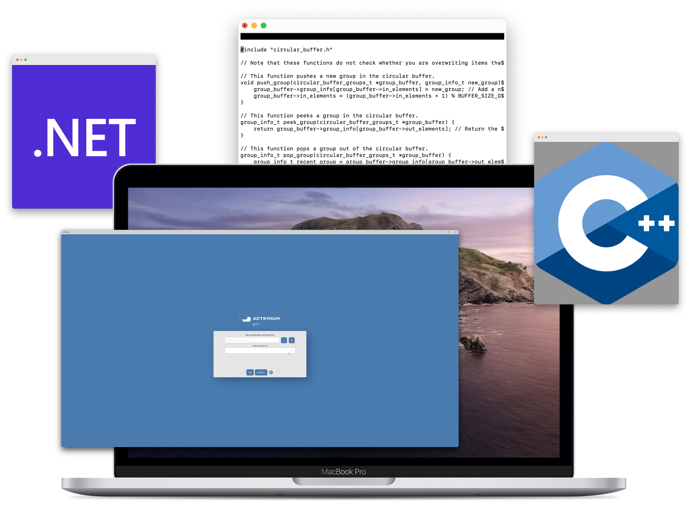

## Welcome to my GitHub page!

Here you can see all the projects I've made over the years. Many projects are an extension of my education, [Applied Computer Science](https://www.saxion.edu/programmes/bachelor/applied-computer-science). I am following this course at [Saxion University of Applied Sciences](https://www.saxion.edu). 
Within this course you are mainly concerned with electronics that are combined with software. You already think so, embedded systems! But that in itself is not that bad, I also develop GUIs among other things, which in this case communicate with a microcontroller. Furthermore, I am personally mainly interested in C, C++, C# and Python.

In my GitHub account you can see which repositories I have given a [star](https://github.com/BobAaldering?tab=stars). Also take a look at all my [repositories](https://github.com/BobAaldering?tab=repositories).

    

